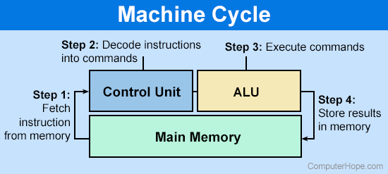

컴퓨터의 역사와 함께 현대적인 컴퓨터의 구조가 어떻게 변화되어 왔는지 가볍게 살펴보기 좋습니다.  
영상: ['컴퓨터'의 구조는 어떻게 되어있을까? CPU와 메모리! [안될과학 - 랩미팅 15화]](https://youtu.be/SiC74U8aJbM)

## 컴퓨터의 구조는 어떻게 되어있을까?

- 컴퓨터의 역사
- 여러 논리들을 전기적으로 표현하는 방법
  - => (CPU 계산에 사용되는) 논리회로
- 기억장치
  - 캐시 메모리 &lt; DRAM &lt; HDD/SSD
- CPU 작업의 한 사이클 = `Clock` 
  
  - 클럭 수를 높였더니 CPU 발열이 상승함
  - 코어의 수를 증가해서 병렬적 처리 가능
  - ref. 양자컴퓨터  ?

 

 

컴퓨터-구조부터 운영체제까지 과목의 전체적인 구조를 살펴보기 좋습니다.  
영상: [컴퓨터구조 운영체제 클라우드 안쉬고 처음부터 끝까지 30분동안 설명하기. 컴퓨터-구조 처음 공부하실 때 참고하세요.](https://youtu.be/uMyKBYF48nY)

# 컴퓨터-구조 / 운영체제

- 컴퓨터 처음 공부하는 분이 뼈대로 알아놓으면 좋고 기술사, 정보처리기사 공부에도 도움이 됨
## 개요
- 폰 노이만 구조

- 컴퓨터 작업의 흐름을 제어해 주는 등의 운영 역할 = 운영체제
- 프로세서(CPU) - 프로세스(실행 중인 프로그램)
- ???????